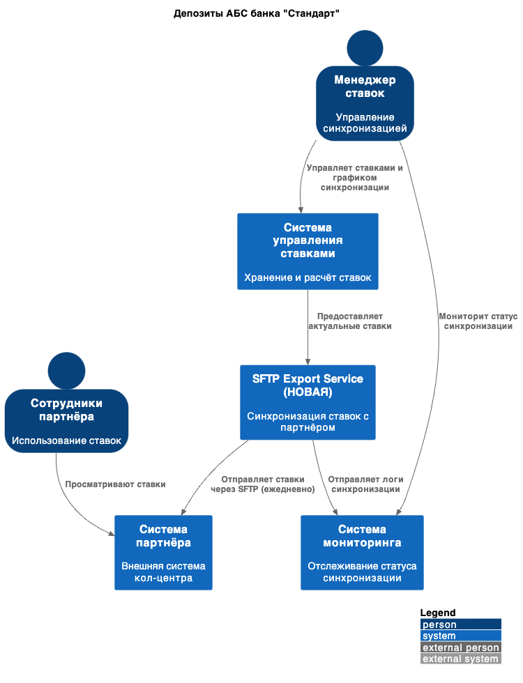
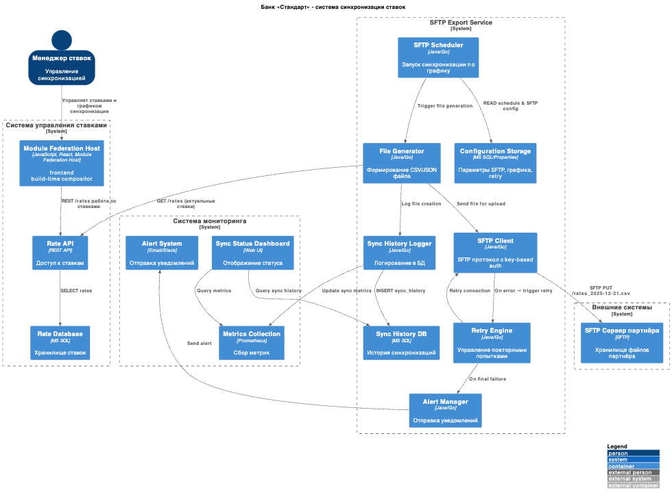

# Задание 4: Архитектура передачи ставок в партнёрский кол-центр (ADR)

**Название задачи:** Архитектурное решение для синхронизации ставок депозитов с партнёрским кол-центром через SFTP
**Автор:** Бурмистров Владимир
**Дата:** Декабрь 2025

## Функциональные требования

| № | Действующие лица или системы | Use Case | Описание |
| :-: | :- | :- | :- |
| UC.1 | Менеджер ставок | Управление графиком синхронизации | Менеджер может настроить время и частоту синхронизации ставок с партнёром (по умолчанию ежедневно в 23:30 UTC+3) |
| UC.2 | SFTP Export Service | Экспорт ставок для партнёра | Каждый день в 23:30 UTC+3 система получает актуальные ставки из Системы упрвления ставками и отправляет их партнёру через SFTP в формате CSV/JSON |
| UC.3 | Партнёрский кол-центр | Получение файла со ставками | Партнёр получает файл через SFTP, сохраняет его в своей системе для консультирования сотрудников |
| UC.4 | Система мониторинга | Отслеживание статуса синхронизации | Система регистрирует все попытки синхронизации, успешные доставки и ошибки для аудита |
| UC.5 | Менеджер бэк-офиса | Ручная синхронизация при сбое | При необходимости менеджер может принудительно инициировать синхронизацию через интерфейс управления |
| UC.6 | Менеджер кол-центра | Просмотр актуальных ставок в интернет-системе партнёра | Сотрудники партнёра видят ставки в своей системе с задержкой не более 24 часов после обновления в банке |
| UC.7 | Система обработки ошибок | Retry-механизм при сбое передачи | При ошибке SFTP система автоматически повторяет попытку каждые 15 минут в течение 2 часов |
| UC.8 | Служба поддержки | Уведомление об ошибках синхронизации | При неудаче после 8 попыток система отправляет алерт команде поддержки и ожидает ручного вмешательства |

## Нефункциональные требования

| № | Требование | Значение | Критичность |
| :-: | :- | :- | :- |
| NFR.1 | Надёжность доставки | 99.5% успешных синхронизаций в месяц | Высокое |
| NFR.2 | Максимальная задержка синхронизации | ≤ 24 часа (партнёру достаточно одного раза в день) | Среднее |
| NFR.3 | Время экспорта файла | ≤ 5 минут на подготовку и передачу | Среднее |
| NFR.4 | Безопасность передачи | SFTP с ключевой аутентификацией (не пароль) | Критичное |
| NFR.5 | Формат файла | CSV или JSON с стандартной структурой | Среднее |
| NFR.6 | История синхронизаций | Хранение логов всех попыток на 12 месяцев | Высокое |
| NFR.7 | Восстановление после сбоя | RTO 30 минут для переповтора синхронизации | Среднее |
| NFR.8 | Шифрование данных | TLS 1.2+ для передачи, шифрование файла при необходимости | Критичное |

## Решение

### Концепция архитектуры

Решение строится на следующих принципах:

1. **Ежедневная асинхронная синхронизация** — не требует real-time доставки; 1 раз в день достаточно для консультирования
2. **Надёжная доставка с retry-механизмом** — автоматические повторы при ошибках SFTP
3. **Простота и безопасность** — использование стандартного SFTP протокола с ключевой аутентификацией
4. **Полная аудитуемость** — все попытки синхронизации логируются для соответствия требованиям регуляторов
5. **Минимум новых компонентов** — реализация в рамках Rate Management System
6. **Интеграция в MVP** — синхронизация запускается ежедневно параллельно обновлению ставок

### Архитектурное решение

#### 1. **SFTP Export Service (часть Rate Management System)**

**Компоненты:**
- **SFTP Export Scheduler** — Cron job, запускается ежедневно в 23:30 UTC+3 (после обновления ставок)
- **File Generator** — формирует CSV/JSON файл с актуальными ставками
- **SFTP Client** — устанавливает безопасное соединение с SFTP сервером партнёра
- **Retry Engine** — управляет повторными попытками при ошибках
- **Sync History Logger** — логирует все попытки в БД для аудита
- **Alert Manager** — отправляет алерты при критичных ошибках

#### 2. **Система мониторинга (Monitoring & Alerting)**

- **Sync Status Dashboard** — отображает статус последней синхронизации
- **Alert System** — отправляет уведомления по email/Slack при ошибках
- **Metrics Collection** — собирает метрики успешных/неудачных синхронизаций
- **Audit Log** — полное логирование для соответствия требованиям регуляторов

#### 3. **Управление конфигурацией**

- **SFTP Configuration** — параметры подключения (хост, порт, путь, ключи)
- **Schedule Configuration** — время синхронизации (по умолчанию 23:30 UTC+3)
- **Retry Policy** — параметры повтора (интервал 15 минут, максимум 8 попыток)
- **File Format Configuration** — выбор CSV или JSON и структуры данных

## Альтернативы

### Альтернатива 1: Real-time API для партнёра (WebAPI)

**Описание**: Предоставить REST API партнёру для получения ставок в реальном времени.

**Преимущества**:
- Real-time доступ к ставкам
- Автоматическое обновление без задержки
- Меньше файловых операций

**Недостатки**:
- Партнёр не имеет возможности вызывать API (требование из задания)
- Требует постоянной поддержки API со стороны банка
- Сложнее для партнёра интегрировать
- Потребует обновления инфраструктуры партнёра
- **Отклонено**

### Альтернатива 2: Синхронизация каждый час

**Описание**: Экспорт ставок каждый час вместо одного раза в день.

**Преимущества**:
- Более актуальные ставки для партнёра
- Партнёр видит изменения быстрее

**Недостатки**:
- Нет деловой необходимости (партнёру достаточно 1 раза в день)
- Увеличивает нагрузку на систему
- Увеличивает объём логов и истории
- Нет требования по SLA < 1 часа
- **Отклонено**

### Альтернатива 3: Хранение файлов в облаке (AWS S3, Azure Blob)

**Описание**: Экспортировать ставки в облачное хранилище вместо SFTP партнёра.

**Преимущества**:
- Резервная копия ставок
- Облегчённое управление версиями
- Возможность версионирования файлов

**Недостатки**:
- Требует взаимодействия с облачными сервисами
- Партнёр может не иметь доступа к облаку
- Дополнительные затраты на облачное хранилище
- Усложняет архитектуру
- **Отклонено**

### Альтернатива 4: Email доставка файла партнёру

**Описание**: Отправить файл со ставками через email.

**Преимущества**:
- Простой способ доставки
- Партнёр получает уведомление

**Недостатки**:
- Ненадёжный способ (может попасть в спам)
- Сложность автоматизации на стороне партнёра
- Нет гарантии доставки
- Требует ручной обработки партнёром
- **Отклонено**

## Недостатки, ограничения, риски

### Недостатки

1. **Задержка в 24 часа**
   - Партнёр видит ставки с задержкой в один день
   - Если ставка изменится ночью, партнёр узнает на следующий день
   - **Решение**: Для консультирования этого достаточно; критичные изменения могут быть отправлены внеочередно

2. **Зависимость от SFTP сервера партнёра**
   - Если сервер партнёра недоступен, синхронизация не пройдёт
   - **Решение**: Retry-механизм; алерты менеджеру; возможность ручной повтора

3. **Формат файла требует согласования**
   - Партнёр должен уметь парсить CSV/JSON формат
   - При изменении структуры нужна координация
   - **Решение**: Стандартный формат; версионирование файла; документация

### Ограничения

1. **SFTP с key-based аутентификацией**
   - Требует управления SSH ключами
   - Необходимо безопасное хранилище ключей
   - **Решение**: Использование Vault или KMS для управления ключами

2. **Ежедневная синхронизация в фиксированное время**
   - Нельзя гарантировать точное время (сети могут быть медленными)
   - **Решение**: Timeout 30 минут; асинхронное выполнение не блокирует другие операции

3. **История синхронизаций может расти быстро**
   - При 365 синхронизациях в год + ошибки будет много логов
   - **Решение**: Архивирование логов старше 12 месяцев; сжатие БД

### Риски

| Риск | Вероятность | Влияние | Снижение |
|------|-------------|--------|----------|
| **SFTP сервер партнёра недоступен** | Средняя | Среднее | Retry 8 раз за 2 часа; алерт менеджеру |
| **Сетевая задержка при передаче** | Низкая | Низкое | Timeout 5 минут; асинхронная обработка |
| **Изменение формата файла у партнёра** | Низкая | Среднее | Версионирование; SLA на совместимость |
| **Утечка ставок при передаче** | Очень низкая | Критичное | TLS 1.2+; SSH key auth; шифрование |
| **Неправильные ставки отправлены партнёру** | Низкая | Высокое | Валидация перед экспортом; unit тесты |
| **Сбой диска с историей синхронизаций** | Очень низкая | Среднее | Replication на резервный сервер; бэкапы |
| **SSH ключ скомпрометирован** | Низкая | Критичное | Ротация ключей; мониторинг доступа |
| **Партнёр получает старые ставки вместо новых** | Низкая | Среднее | Версионирование файла; проверка даты |
